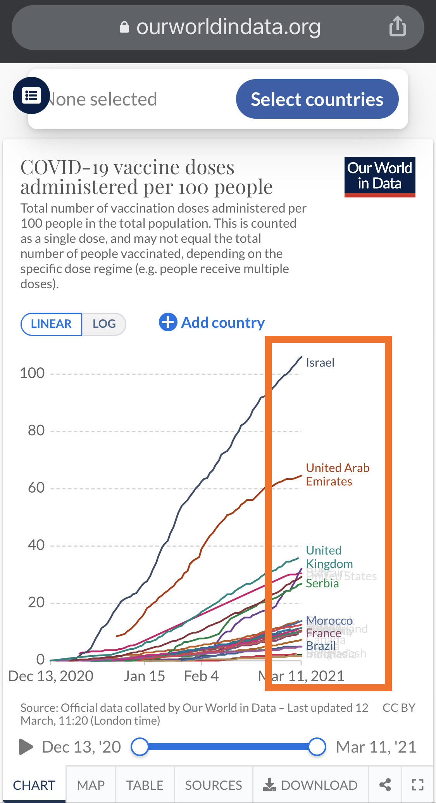

# GEOG458 Final Essay Analysis

### **Context**

On March 11th 2020 The World Health Organization (WHO) declared COVID-19 a global pandemic. One year later, in 2021 we can reflect and see how COVID-19 has changed our everyday lives and has forever impacted families, lifestyles, politics, economics and healthcare.

The focus of this narrative and analysis is to explore and focus on the ever relevant topic of COVID-19. However, instead of focusing on the tragedies, deaths, cases, test rates, hospilizations, mortality risks and transmission rates of the disease it will explore a project that focuses on the distribution, impact, and opinions on vaccine distribution. 

I chose to explore a project with a focus on vaccines because the vaccine rollout has the opportunity to shift our lives back into what we knew as a “normal” life.

## [Our World in Data | Coronavirus Pandemic Data Explorer | Vaccinations](https://ourworldindata.org/covid-vaccinations)

### The Sources of the Project and its Works

---

The data displayed in the project is country specific. The project included a detailed list of all the country-specific sources. Most of the data from each country originate from governmental health agencies.  Most sources include Ministries of Health, general government agencies such as Emergency and Disaster Management Authorities and organizations such as those that resemble the CDC (Centers for Diseases Control and Prevention).

The works of this project are cited in other [projects such as those at John Hopkin’s University](https://coronavirus.jhu.edu/vaccines/us-states#vaccination-rollout-us) where they are also tracking vaccination progress with a focus more centric on the United States.

According to the source,the project is updated each morning (London time) “with the most recent official numbers up to the previous day”

#### Open Access
The datasets used for this project are openly available for use by the general public. The data can be found in [Our World in Data’s COVID-19 Vaccination GitHub repository](https://github.com/owid/covid-19-data/tree/master/public/data/vaccinations) which is updated daily.

### **The Project Topic** 

---

The following questions and topics are explored in the project 
- COVID-19 Vaccinations
- County-by country data on COVID-19 vaccination
- How many COVID-19 vaccine doses are administered daily?
- How many COVID-19 vaccination does have been administered?
- What share of the population has received at least one dose of the COVID-19 vaccine?
- What share of the population has been fully vaccinated against COVID-19?
- Which vaccines have been administered in each country?
- Vaccination policies
- Attitudes to COVID-19 vaccinations
- Vaccine development:vaccines approved for use and in clinical trials

### **What is the Project?**

--- 

The digital geography project that will be explored in this analysis was produced by the “Our World in Data” Organization. The project is a “Coronavirus Pandemic Data Explorer”, for the purposes of this assignment I will focus solely on the Vaccination portion of the project. The Data Explorer produced serves to inform, educate and give insight into vaccine rollout across the world. The project includes chloropleth world maps that focus on specific questions posed around vaccine rollout such as cumulative does, dose distribution rate, daily dose rates, vaccine type. 

### **How is the Data Displayed?**

---

The data is displayed through three methods, maps, charts/graphs and tables. 

World maps are the default display but there is the option to view specific regions or areas of the World. The view breakdown of the areas is similar to that of continents - you can choose to change the view to Asia, Europe, Africa, Oceania, North or South America.  The maps utilizes  pop ups on hover to share information relevant to the country of interest. Upon hovering, the project informs you of the information of interest and the last data update for the country. In addition, upon hovering you can click the area of interest to see the data progression over time. When viewing the color code-ed key you can also click the content of the key to highlight the affected areas.

Aside from the maps displays the project provides the data in alternative methods such as a table and or chart/graph. The chart/graph functions focuses on a handful of countries that have relevant data for the question of interest. You can choose to view specific countries of interest. Upon hover you are able to view specific data points based on day or amount. The chart/graph displays also incorporates a time lapse slider function which allows one to see change over a time period. The time lapse function is also applicable to the map view but does not have as much of an efficient impact. 

The table view is the most raw display of the data, it includes the least and minimal interactive functions. The interactive features for the tables include filtering by country and by alphabetical or maximum and minimum amounts. The time lapse function is still functional for the table view but the effectiveness in telling a story is low. 

All three methods effectively display data, providing insight into the vaccine distribution and rollout in various countries.

Since the data is divided by specific questions of interest all the maps pose only a thematic layer to represent the question in view. 

### **System Architecture**

---

The assumption is that the maps, charts, tables used for this project are using several serves to do so. Databases and file servers hold all the data.From the open access the sources GitHub repository that holds the data for the project it can be seen that the data is stored in .csv files. The assumption from this is that a user would import files and use SQL to clean and apply datasets as needed.

### **Cross Platform Compatibility & Critiques**

---

Some projects are difficult to view on mobile devices. This project projects quite nicely onto iOS mobile devices and can withstand the same interactive features. Similar to other projects there is some aesthetic loss of content being restricted to the size of mobile devices. Upon viewing charts and graphs on a mobile device there is often a clutter from overlapping text, hence making it difficult to read and decipher the intended messages (shown in image below inside orange box). 

Color schemes continue to be an active and potentially passive means of portraying opinions and narratives. Colors are able to portray different tones and sway perspectives. The project utilizes red, greens and blues on the choropleth maps depending on the question posed that it is trying to answer. This subtle yet distinct difference in color schemes could be intentional to try to persuade and pursue different political motives or set different tones. Despite the lack of uniformity across color schemes of the choropleth maps there is not a major distraction from the data that is being portrayed. 

The project includes regions that do not have relevant information due to the nature of mapping on a global scale. Aside from the lack of data from areas I think the project gives attention to if a map is sourced specifically from one location rather than an aggregate . As seen below

One interesting component of this project is that it explores the distribution of different COVID-19 vaccines by manufacturer. This one component provides insight into the politics and economics of vaccine manufacturing and approval processes. The chart display section does not fully show this story but the hints can be seen in the sources section of the project since vaccines are listed by country.

### **Key Takeaways and Implications**

---

This project provides insight into the vaccine rollout and distribution that is occurring worldwide. Despite this project being updated daily it is important to note that the data captured is representing only one narrative and perspective. This project provides a large overview of the distribution of vaccines but on a smaller scope it does not represent the continual struggle and difficulty of rolling out vaccines. This project however allows us to track the progress of vaccine rollout and can help predict a situation in which vaccination rates have reached a point where herd immunity is established and life can return to “normal”.

